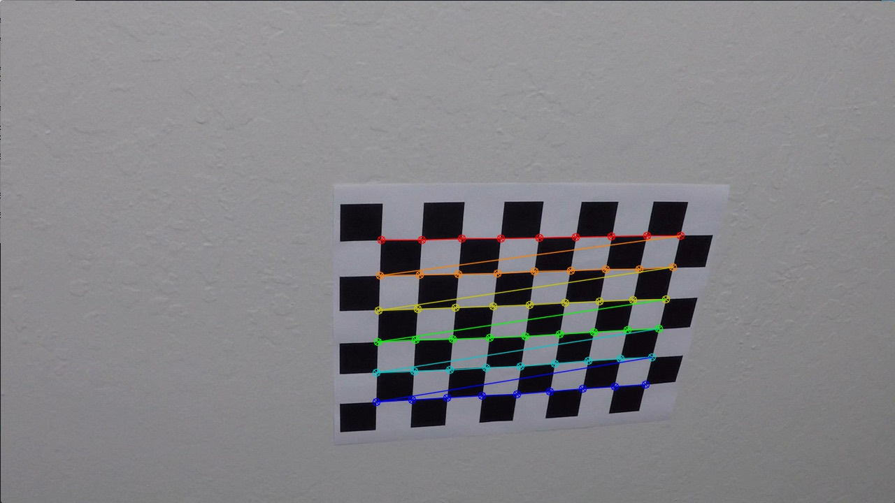

**Advanced Lane Finding Project**

The goals / steps of this project are the following:

* Compute the camera calibration matrix and distortion coefficients given a set of chessboard images.
* Apply a distortion correction to raw images.
* Use color transforms, gradients, etc., to create a thresholded binary image.
* Apply a perspective transform to rectify binary image ("birds-eye view").
* Detect lane pixels and fit to find the lane boundary.
* Determine the curvature of the lane and vehicle position with respect to center.
* Warp the detected lane boundaries back onto the original image.
* Output visual display of the lane boundaries and numerical estimation of lane curvature and vehicle position.

---

### Camera Calibration

#### Computation of camera matrix and distortion coefficients.

The code is part of rubric1.py.

I have walked through all calibration files with generated object points (`objpoints`) of real world 3D points of the chessboard simplifying by z==0. 
Finding corners by `cv2.findChessboardCorners` function. Corners represent the image points (`imgpoints`).



This did not work for all calibration files.

See for example  because the expectation was to find 9x6 corners.

By having collected object and image points the function `cv2.calibrateCamera` have been applied to get rotation, translation coeffieceint from distorted to undistorted images.


Evaluation is showing an mean error of 0.13 which is near zero.

### Pipeline (single images)

#### Example of a distortion-corrected image.

I have loaded the saved pickle object data of the calibration coefficients and applied `cv2.undistort`. This code is part of rubric2.py

Original:


Undistorted:


All other images can be analysed by:
```
python find_line.py path_to_image -v
```

#### Using color transforms, gradients or other methods to create a thresholded binary image.

The thresholding is done by transform.py module and is applied in find_line.py. 
The outcome must be a good indicator for line detection under several condition of lightning and obstructions (trees, bridges, signs) to name a few.

```
    binary_warped[((hls_binary == 1) & ( rgb_binary == 1)) | ((sobelx_binary == 1)) | ((mag_binary == 1) & (dir_binary == 1))] = 1
```

The result for input image can be generated by calling.
```
python find_line.py test_images/test2.jpg -v
```
For example:


Result output is:


Additionally instead of using grayscale image the R channel of RGB was used as it was indicating better line highlighting before applying further filters.

#### Perspective transformation for region of interest.

The perspective transformation is done by the perspective.py module and applied in find_line.py.

By using the camera calibration information the image was first undistorted by `cv2.undistort(img, mtx, dist, None, mtx)` function:

Original image:


Undistorted image


which results in 

and will be explaing shortly in next lines how it was achieved.

The final result is achieved by the `warper` function which uses `cv2.getPerspectiveTransform(src, dst)` and `cv2.warpPerspective(img, M, img_size, flags=cv2.INTER_LINEAR)`
to create the transformed perspective.

Whereby the `src` is choosen with


and the `dst` is choosen to
.

#### Identifying lane-line pixels and fit their positions with a polynomial

The lines are identified as part of `processing_frame` in find_line.py module.

For the given binary input


a histogram is created to sum up binary result 


to extract starting point for the line detection.

Afterwards the lines are searched by a sliding window with 

covering specific area and adjusting based on found none zero binary (x,y) points.

#### Radius of curvature of the lane and the position of the vehicle with respect to center.

Based on [radius of curvature](http://www.intmath.com/applications-differentiation/8-radius-curvature.php) and udacity class nice explanation.

The curvature in the picture is from left line which was calculated in find_line.py module and result is:


And the offset to center was calculated from midpoint of right and left line to center of the image.

#### Result of lines plotted back down onto the road.

As part of find_line.py with the lines drawn on blank image transformed back by the inverse of perspective transform matrix `M` and combined with 
undistorted original image.


---

### Pipeline (video)

The final pipeline video is [result_project_video.mp4](./result_project_video.mp4).

```
python find_line.py project_video.mp4 -v
```

---

### Discussion

Challenging part to find sufficient approach. Played around with different color channels, filters and thresholding combinations. Still hard to find right balance
for several possible scenarios to cover. Nevertheless it just fits to this example. As for example the current pipeline fails 
on the challenges videos ([result_challenge_video.mp4](./result_challenge_video.mp4), [result_harder_challenge_video.mp4](./result_harder_challenge_video.mp4)) or even simply switching lines, sharp road curves and more occlusions through 
bridges, trees or even roads which are under constructions. The day and night or changing weather conditions screw up the whole stability of detecting the lines.
To make it more robust maybe it would be helpful to consider more analysis and learn more features of roads and make it more generic and staying on the road no matter
whether the are lines or different types of road bondaries.

### Next steps 

Play more around with road structures and check own videos.